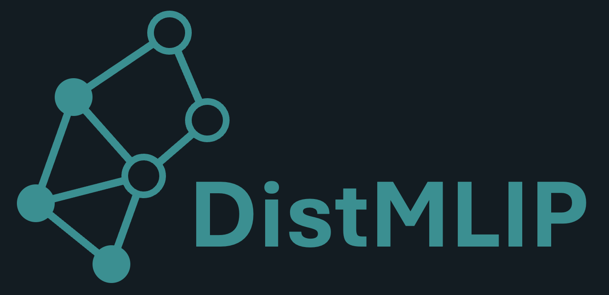

  

# DistMLIP: An Inference Platform for Fast, Large Scale Atomistic Simulation

## About
DistMLIP is an easy-to-use, efficient library for running large-scale multi-GPU simulations using popular machine learning interatomic potentials (MLIPs). 

DistMLIP currently supports zero redundancy multi-GPU inference for MLIPs using graph parallelism. Unlike space partitioning via LAMMPS, there is no redundant calculation being performed.

DistMLIP currently supports the following models:
* CHGNet ([MatGL](https://github.com/materialsvirtuallab/matgl))
* TensorNet ([MatGL](https://github.com/materialsvirtuallab/matgl))
* MACE (future work planned)

**Performance Benchmark**
TODO

## Getting Started
Install DistMLIP from pip or from source:
TODO

View one of our example notebooks [here](./examples) to get started. DistMLIP is a mix-in library designed to inherit other models. As a result, all features of the original package (whether it's MatGL or MACE) should still work.

## Citation
If you use DistMLIP in your research, please cite our paper:
TODO

## Contact Us
* If you have any feature requests, please raise an issue on this repo.
* If you would like to contribute or want us to parallelize your model, please email kevinhan@cmu.edu.
* For collaborations and partnerships, please email kevinhan@cmu.edu.
